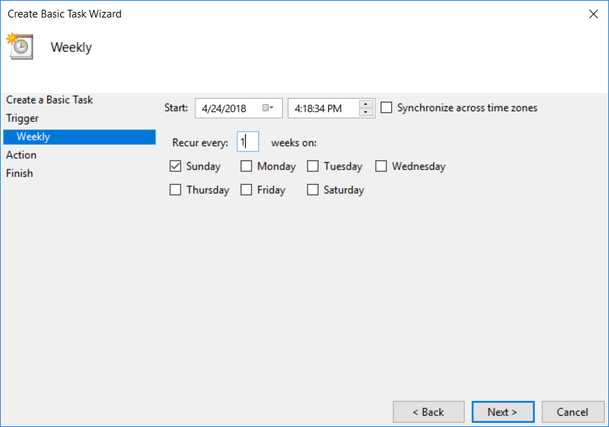

## SQL Express = No Agent

One of the biggest feature limitations of SQL Server Express is the exclusion of
the SQL Agent. Not only does SQL Agent work wonderfully for managing ETL, SSIS,
and maintenance jobs across one or more servers, but it also functions as a general
job scheduler. It can execute any PowerShell or command prompt script to take care of
any number of processes or jobs that may be 100% external to SQL Server.

Without a SQL Agent, the default option for [managing backups](http://expressdb.io/sql-server-express-backups/) and [maintenance scripts](http://expressdb.io/sql-server-express-maintenance/) on SQL Server Express is not an option. Luckily, one of the next best alternatives is free, included in Windows,
and takes very little time to configure. Enter Windows Task Scheduler!

## Windows Task Scheduler

To utilize the task scheduler, a task must be created that will execute a batch script containing the code to run on the SQL Express Instance. In this eample, it will be a maintenance job
that will be run weekly to ensure indexes are defragmented on user databases. The
settings for the maintenance job will be copied directly from Ola's scripts to replicate
the parameters that are used to create a job when the SQL Agent is available.

* [Creating a Task via GUI](#task-scheduler-gui)
* [Creating a Task via Command Line](#task-scheduler-command-line)

### Task Scheduler GUI

1. Install [Ola Hallengren's maintenance scripts](https://ola.hallengren.com/sql-server-index-and-statistics-maintenance.html) if they haven't been already. *There may be a message about SQLServerAgent not running when installing these scripts. That is expected since the agent isn't available, but will not affect the installation.*

2. Create a `.bat` file for the sqlcmd script that will run the maintenance stored procedure:
    

3. Search for "Task Scheduler" from the start menu to open the scheduler

4. Right click "Task Scheduler" and select "Create Basic Task"
      

       
      
       
      

5. Input a name and description for the task.
      

       
      
       
      

6. Pick a weekly schedule or one that works based on the database's usage.
      

       
      
       
      

7. Choose "Start a Program" as the action type.

8. Insert the `.bat` file created earlier.
      

       
      
       
      

9. Test run the job to ensure it is working as expected.

Repeat the above steps to handle database backups, DBCC checks, and other database maintenance as needed.

### Task Scheduler Command Line

Using Windows Task Scheduler from the command line involves running [schtasks.exe](https://msdn.microsoft.com/en-us/library/windows/desktop/bb736357(v=vs.85).aspx) to schedule and configure tasks.

1. Install [Ola Hallengren's maintenance scripts](https://ola.hallengren.com/sql-server-index-and-statistics-maintenance.html) if they haven't been already. *There may be a message about SQLServerAgent not running when installing these scripts. That is expected since the agent isn't available, but will not affect the installation.*

2. Create a `.bat` file for the sqlcmd script that will run the maintenance stored procedure:
    

3. Replace the placeholder values and run the script below to create a scheduled task:
 * `RU` - Windows user the task will run as.
 * `RP` - Password for the RU.
 * `SC` - Run schedule (MINUTE, HOURLY, DAILY, WEEKLY, MONTHLY, ONCE, ONLOGON, ONIDLE, or ONEVENT.)
 * `TN` - Task Name.
 * `TR` - A value that specifies the path and file name of the task to be run.
 * `MO` - Modifier to add more fine grained control over the schedule:
        * MINUTE: 1 - 1439 minutes.
        * DAILY: 1 - 365 days.
        * WEEKLY: weeks 1 - 52.
        * MONTHLY: 1 - 12, or FIRST, SECOND, THIRD, FOURTH, LAST, and LASTDAY.
        * ONEVENT: XPath event query string.  
 * `D` - A value that specifies the day of the week to run the task. Valid values are: MON, TUE, WED, THU, FRI, SAT, SUN and for MONTHLY schedules 1 - 31 (days of the month). The wildcard character ( * ) specifies all days.
 * `M` - A value that specifies months of the year. Defaults to the first day of the month. Valid values are: JAN, FEB, MAR, APR, MAY, JUN, JUL, AUG, SEP, OCT, NOV, and DEC. The wildcard character ( * ) specifies all months.

 
    

Repeat the above steps to handle database backups, DBCC checks, and other database maintenance as needed.

## Further Reading

* [FAQ on Ola Hallengren's Scripts](https://ola.hallengren.com/frequently-asked-questions.html)
* Microsoft KB on [How to Schedule and Autoamte Backups of SQL Server Databases in SQL Server Express](https://support.microsoft.com/en-us/help/2019698/how-to-schedule-and-automate-backups-of-sql-server-databases-in-sql-se)
* Microsoft Documentation on [sqlcmd](https://docs.microsoft.com/en-us/sql/tools/sqlcmd-utility?view=sql-server-2017)
