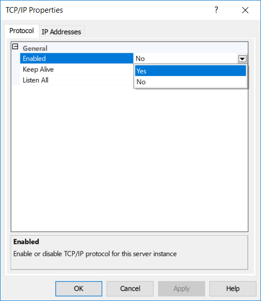

## Express vs Other Editions' Security

Conveniently, security best practices for SQL Server Express are almost
the exact same as they are for any other more fully featured edition.

The primary difference is that by default, SQL Server Express has its networking
protocols disabled by default. This means that out of the box, SQL Express isn't available
to be connected to by other computers on a network. This actually makes it far **more** secure
by default than other editions. If SQL Server Express is being bundled with an application
and both are residing on the same server, this default setting creates a very secure
instance without needing further customization.

Otherwise, standard best practices apply. Since general security is out of the scope
of this site, see the [Further Reading](#further-reading) section at the bottom of this page
for general security recommendations.

### Enabling Network Connectivity
If the Express instance needs to be available on a network, however, the following steps need
to be completed:

1. Open SQL Server Configuration Manager

      

      
       
      

2. Expand "SQL Server Network Configuration"
3. Select "Protocols for MSSQLSERVER" (or a custom instance name)
4. On the right pane, right click "TCP/IP" and choose "Properties"

      

      
       
      

5. In the "Protocol" tab, make sure "Enabled" is set to **Yes**

      

      
       
      

6. In the "IP Addresses" tab, scroll to the bottom of the dialogue to the header "IPAll" and  make sure the TCP Port is set to 1433 and apply all changes.

      

      
       
      

7. Open the computer's Services find "SQL Server Browser" right click to open the "Properties" dialogue

      

      
       
      

8. Set start to "Automatic" and apply the changes.

      

      
       
      

## Further Reading

* Microsoft Documentation's [SQL Server Express Security](https://docs.microsoft.com/en-us/dotnet/framework/data/adonet/sql/sql-server-express-security)
* Microsoft Documentation's [Securing SQL Server](https://docs.microsoft.com/en-us/sql/relational-databases/security/securing-sql-server)
* MSSQLTips' [SQL Server Security Checklist](https://www.mssqltips.com/sqlservertip/3159/sql-server-security-checklist/)
* Robert Sheldon's [How to Get SQL Server Security Horribly Wrong](https://www.red-gate.com/simple-talk/sql/database-administration/how-to-get-sql-server-security-horribly-wrong/)
