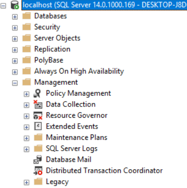

## Mail without SQL Agent?

 

The Database Mail feature as seen   in other SQL Server editions.

While SQL Server Express is still 100% able to send mail using msdb's stored procedures,
most people rely on Management Studio's GUI and the Database Mail feature to do the initial setup of profiles and accounts
to make sending mail possible. Despite this limitation, the underlying stored procedures located within the msdb database are still fully able to replication the GUI driven setup that Database Mail aids in. This leaves T-SQL as the primary alternative for enabling and configuring SQL Server Express so that `sp_send_dbmail` can be used to send mail out. Adding this functionality with a [replacement for SQL Agent](http://expressdb.io/sql-server-express-replace-sql-agent/) can help mimic much of the functionality that Database Mail and SQL Agent provide on the full featured editions of SQL Server.

While a CLR can also be used to send mail, that route is far more work and increases the complexity of
sending mail via SQL Server quite a bit. This requires enabling CLRs, which is disabled by default. Enabling CLRs opens the instance up to external code, which may be a security or audit concern and is often allowed in many corporate environments. 

## Setting up Mail on SQL Server Express

The below code sample demonstrates the entire process of setting up mail on SQL Server Express,
including sending a test email at the end.

The setup will:

1. Create a mail account
2. Create a mail profile
3. Add the account to the profile
4. Add permission to use the profile for a user or role
5. Enable database mail XPs
6. Send a test email

The stored procedures required are:

* [sysmail_add_account_sp](https://docs.microsoft.com/en-us/sql/relational-databases/system-stored-procedures/sysmail-add-account-sp-transact-sql?view=sql-server-2017)
* [sysmail_add_profile_sp](https://docs.microsoft.com/en-us/sql/relational-databases/system-stored-procedures/sysmail-add-profile-sp-transact-sql?view=sql-server-2017)
* [sysmail_add_profileaccount_sp](https://docs.microsoft.com/en-us/sql/relational-databases/system-stored-procedures/sysmail-add-profileaccount-sp-transact-sql?view=sql-server-2017)
* [sysmail_add_principalprofile_sp](https://docs.microsoft.com/en-us/sql/relational-databases/system-stored-procedures/sysmail-add-principalprofile-sp-transact-sql?view=sql-server-2017)
* [sp_configure](https://docs.microsoft.com/en-us/sql/relational-databases/system-stored-procedures/sp-configure-transact-sql?view=sql-server-2017)
* [sp_send_dbmail](https://docs.microsoft.com/en-us/sql/relational-databases/system-stored-procedures/sp-send-dbmail-transact-sql?view=sql-server-2017)

### The Code


